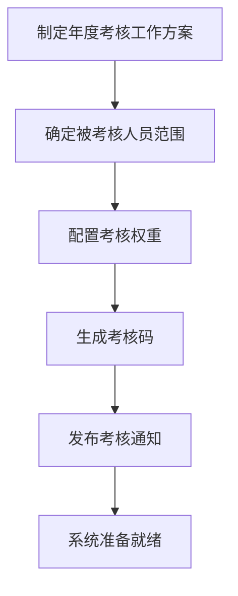
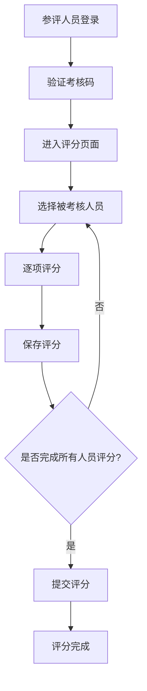
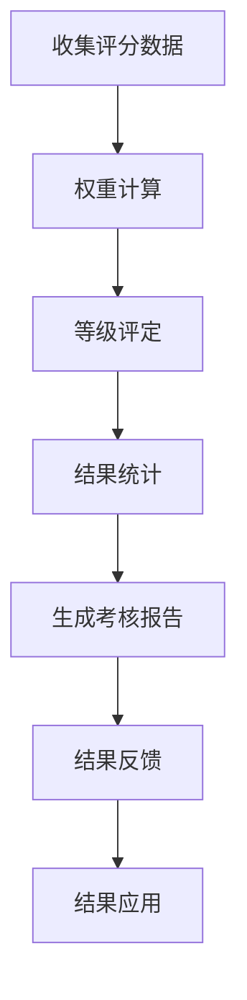
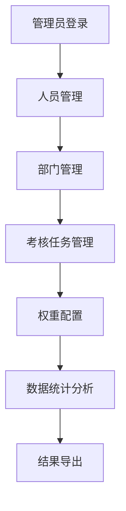
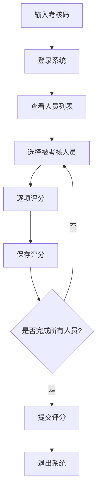

# 中煤平朔集团有限公司中层管理人员考核系统业务流程说明

## 1. 考核工作总体流程

### 1.1 考核工作阶段
根据考核办法，考核工作分为以下阶段：
1. **准备阶段**：制定考核方案，确定考核范围
2. **实施阶段**：组织考核测评，收集评分数据
3. **汇总阶段**：统计考核结果，形成考核报告
4. **应用阶段**：反馈考核结果，应用考核成果

### 1.2 考核工作组织架构
- **考核工作领导小组**：组长、副组长由公司总经理、党委书记担任
- **考核工作办公室**：设在公司人力资源部（党委组织部）
- **考核组**：负责具体考核实施工作

## 2. 系统业务流程

### 2.1 考核前准备流程

#### 2.1.1 制定考核方案
- 根据考核办法制定年度考核工作方案
- 确定考核时间、范围、方式
- 配置考核权重分配

#### 2.1.2 确定考核范围
- **被考核人员**：平朔公司管理的中层及中层以上管理人员
- **考核人分类**：
  - 公司班子成员（权重50%）
  - 公司中层管理人员（权重25%）
  - 单位班子成员相互测评及基层管理人员、职工代表民主测评（权重25%）

#### 2.1.3 配置考核权重
根据考核办法要求配置权重：

| 考核人类型 | 权重 | 细分权重 |
|------------|------|----------|
| 公司班子成员 | 50% | 总经理20%、党委书记20%、分管领导15%、其他班子成员45% |
| 公司中层管理人员 | 25% | - |
| 单位班子成员相互测评及基层管理人员、职工代表民主测评 | 25% | 相互测评最高30%、基层测评不低于70% |

#### 2.1.4 生成考核码
- 为每个参评人员生成8位考核码
- 设置考核码使用状态
- 分配考核码权重

### 2.2 考核实施流程

#### 2.2.1 参评人员登录
- 使用8位考核码登录系统
- 系统验证考核码有效性
- 登录成功后进入评分页面

#### 2.2.2 评分过程
- **选择被考核人员**：从本单位人员列表中选择
- **逐项评分**：对五个维度分别评分
  - 政治素质（权重20%）
  - 工作业绩（权重30%）
  - 领导能力（权重20%）
  - 勤勉尽责（权重20%）
  - 廉洁自律（权重10%）
- **评分等级**：优秀、良好、一般、较差
- **实时保存**：评分过程中自动保存

#### 2.2.3 评分提交
- 完成所有人员评分后提交
- 提交后无法再次修改
- 系统记录提交时间和操作日志

### 2.3 考核结果处理流程

#### 2.3.1 数据收集与计算
- 收集各层次打分数据
- 按权重计算加权平均分
- 确定考核等级

#### 2.3.2 等级评定标准
- **优秀**：得分90分以上
- **良好**：得分75-89分
- **一般**：得分60-74分
- **较差**：得分59分以下

#### 2.3.3 结果统计
- 个人得分统计
- 部门得分统计
- 等级分布统计
- 权重影响分析

### 2.4 考核结果应用流程

#### 2.4.1 结果反馈
- 向被考核单位班子反馈综合考评结果
- 考核结果存入被考核人档案

#### 2.4.2 结果应用
- 作为公司选拔任用管理人员的依据
- 作为公司绩效薪酬发放的参考依据
- 对考核结果一般的人员进行诫勉谈话
- 连续二年考核结果为一般的或年度考核结果为较差的进行组织调整

## 3. 系统操作流程

### 3.1 管理员操作流程

#### 3.1.1 基础数据管理
- **人员管理**：添加、编辑、删除被考核人员
- **部门管理**：维护部门信息
- **考核码管理**：生成、分配、管理考核码

#### 3.1.2 考核任务管理
- **创建考核任务**：设置考核年度、时间、范围
- **配置权重**：设置各考核人权重
- **监控进度**：实时监控考核完成情况

#### 3.1.3 数据统计分析
- **个人得分**：查看个人详细得分
- **部门统计**：按部门统计考核结果
- **等级分布**：统计各等级人员分布
- **数据导出**：导出Excel、PDF报告

### 3.2 参评人员操作流程

## 4. 质量控制流程

### 4.1 数据质量控制
- **考核码验证**：确保考核码唯一性和有效性
- **评分范围检查**：确保评分在合理范围内
- **完整性检查**：确保所有人员都已评分
- **权重验证**：确保权重配置正确

### 4.2 过程质量控制
- **操作日志**：记录所有操作行为
- **数据备份**：定期备份考核数据
- **异常处理**：及时处理异常情况
- **安全控制**：确保数据安全

### 4.3 结果质量控制
- **数据校验**：校验计算结果准确性
- **一致性检查**：检查数据一致性
- **异常分析**：分析异常数据
- **结果审核**：审核考核结果

## 5. 应急预案

### 5.1 技术故障处理
- **系统故障**：启动备用系统
- **数据丢失**：从备份恢复数据
- **网络故障**：启用离线模式
- **安全事件**：启动安全应急预案

### 5.2 业务异常处理
- **考核码问题**：重新生成考核码
- **评分异常**：调查并处理异常评分
- **数据不一致**：核实并修正数据
- **用户投诉**：及时处理用户反馈

## 6. 考核工作注意事项

### 6.1 考核原则
- **实事求是、客观公正**
- **目标导向、岗责一致**
- **注重实效、便于操作**
- **考核与激励相结合**

### 6.2 参评人员要求
- 基层管理人员（副主管、主管层级）全部参加
- 公司职能管理部门及总人数50人以下的单位全员参加
- 总人数50人以上的单位，参加测评人员为50-150人，但必须保证单位职工代表参评率不低于50%

### 6.3 考核纪律
- 严格按照考核办法执行
- 确保考核过程公平、公正、公开
- 保护参评人员隐私
- 维护考核数据安全

---

**重要提醒**：本业务流程严格按照考核办法要求设计，确保考核工作的规范性和有效性。 